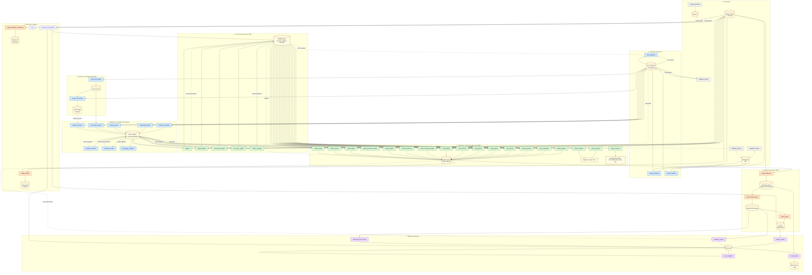
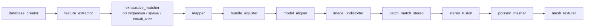

# Claude Session — Organiser workflow COLMAP avec graphe de dépendances

- **Session ID**: `f3f753a3-e931-441e-af0b-c61c66dea6d3`
- **Workspace**: `<workspace>`
- **Claude Code version**: 2.1.233
- **Git branch**: main
- **Start**: 2026-08-19 00:25:47
- **End**: 2026-08-19 00:30:52

---

## User — 2026-08-19 00:25:47

".\COLMAP.bat --help" indique:
```
Available commands:
  help
  version
  gui
  automatic_reconstructor
  bundle_adjuster
  color_extractor
  database_cleaner
  database_creator
  database_merger
  advancing_front_mesher
  delaunay_mesher
  exhaustive_matcher
  feature_extractor
  feature_importer
  geometric_verifier
  global_mapper
  guided_geometric_verifier
  hierarchical_mapper
  image_deleter
  image_filterer
  image_rectifier
  image_registrator
  image_undistorter
  image_undistorter_standalone
  mapper
  matches_importer
  mesh_simplifier
  mesh_texturer
  model_aligner
  model_analyzer
  model_clusterer
  model_comparer
  model_converter
  model_cropper
  model_merger
  model_orientation_aligner
  model_splitter
  model_transformer
  patch_match_stereo
  point_filtering
  point_triangulator
  pose_prior_mapper
  poisson_mesher
  project_generator
  rig_configurator
  rotation_averager
  sequential_matcher
  spatial_matcher
  stereo_fusion
  transitive_matcher
  view_graph_calibrator
  vocab_tree_builder
  vocab_tree_matcher
  vocab_tree_retriever
```

Tu as 2 missions:
  - Génère moi un graph ordonnée de ces commandes afin de savoir dans quel ordre les appeler. Il est évident qu'on ne peut pas appeler tous en séquentiel. Chaque neoud du graph (chaque commande) peut donc avoir de nombreux prédécesseurs et de nombreux successeurs. Génère moi le graph au format mermaid. 
- Donne moi une description de chaque commande.

---

## Assistant — 2026-08-19 00:25:49

Je vais examiner le code source pour comprendre les entrées/sorties réelles de chaque commande, puis construire le graphe.

---

## Assistant — 2026-08-19 00:25:51

**Tool call: `Bash`** — List exe source files
```bash
ls <workspace>/src/colmap/exe/
```

---

## Assistant — 2026-08-19 00:25:51

**Tool call: `Bash`** — Read main colmap.cc command registry
```bash
cat <workspace>/src/colmap/exe/colmap.cc | head -200
```

---

## User — 2026-08-19 00:25:52

**Result:**
```
CMakeLists.txt
colmap.cc
database.cc
database.h
feature.cc
feature.h
gui.cc
gui.h
image.cc
image.h
image_test.cc
model.cc
model.h
mvs.cc
mvs.h
sfm.cc
sfm.h
sfm_test.cc
vocab_tree.cc
vocab_tree.h
```

---

## User — 2026-08-19 00:25:52

**Result:**
```
// Copyright (c), ETH Zurich and UNC Chapel Hill.
// All rights reserved.
//
// Redistribution and use in source and binary forms, with or without
// modification, are permitted provided that the following conditions are met:
//
//     * Redistributions of source code must retain the above copyright
//       notice, this list of conditions and the following disclaimer.
//
//     * Redistributions in binary form must reproduce the above copyright
//       notice, this list of conditions and the following disclaimer in the
//       documentation and/or other materials provided with the distribution.
//
//     * Neither the name of ETH Zurich and UNC Chapel Hill nor the names of
//       its contributors may be used to endorse or promote products derived
//       from this software without specific prior written permission.
//
// THIS SOFTWARE IS PROVIDED BY THE COPYRIGHT HOLDERS AND CONTRIBUTORS "AS IS"
// AND ANY EXPRESS OR IMPLIED WARRANTIES, INCLUDING, BUT NOT LIMITED TO, THE
// IMPLIED WARRANTIES OF MERCHANTABILITY AND FITNESS FOR A PARTICULAR PURPOSE
// ARE DISCLAIMED. IN NO EVENT SHALL THE COPYRIGHT HOLDERS OR CONTRIBUTORS BE
// LIABLE FOR ANY DIRECT, INDIRECT, INCIDENTAL, SPECIAL, EXEMPLARY, OR
// CONSEQUENTIAL DAMAGES (INCLUDING, BUT NOT LIMITED TO, PROCUREMENT OF
// SUBSTITUTE GOODS OR SERVICES; LOSS OF USE, DATA, OR PROFITS; OR BUSINESS
// INTERRUPTION) HOWEVER CAUSED AND ON ANY THEORY OF LIABILITY, WHETHER IN
// CONTRACT, STRICT LIABILITY, OR TORT (INCLUDING NEGLIGENCE OR OTHERWISE)
// ARISING IN ANY WAY OUT OF THE USE OF THIS SOFTWARE, EVEN IF ADVISED OF THE
// POSSIBILITY OF SUCH DAMAGE.

#include "colmap/exe/database.h"
#include "colmap/exe/feature.h"
#include "colmap/exe/gui.h"
#include "colmap/exe/image.h"
#include "colmap/exe/model.h"
#if defined(COLMAP_MVS_ENABLED)
#include "colmap/exe/mvs.h"
#endif
#include "colmap/exe/sfm.h"
#include "colmap/exe/vocab_tree.h"
#include "colmap/util/oiio_utils.h"
#include "colmap/util/version.h"

namespace {

using command_func_t = std::function<int(int, char**)>;

void ShowVersion() {
  std::cout << colmap::GetVersionInfo() << " (" << colmap::GetBuildInfo()
            << ")\n";
}

void ShowHelp(
    const std::vector<std::pair<std::string, command_func_t>>& commands) {
  ShowVersion();

  std::cout << "Usage:\n";
  std::cout << "  colmap [command] [options]\n";

  std::cout << "Documentation:\n";
  std::cout << "  https://colmap.github.io/\n";

  std::cout << "Example usage:\n";
  std::cout << "  colmap help [ -h, --help ]\n";
  std::cout << "  colmap gui\n";
  std::cout << "  colmap gui -h [ --help ]\n";
  std::cout << "  colmap automatic_reconstructor -h [ --help ]\n";
  std::cout << "  colmap automatic_reconstructor --image_path IMAGES "
               "--workspace_path WORKSPACE\n";
  std::cout << "  colmap feature_extractor --image_path IMAGES --database_path "
               "DATABASE\n";
  std::cout << "  colmap exhaustive_matcher --database_path DATABASE\n";
  std::cout << "  colmap mapper --image_path IMAGES --database_path DATABASE "
               "--output_path MODEL\n";
  std::cout << "  ...\n";

  std::cout << "Available commands:\n";
  std::cout << "  help\n";
  std::cout << "  version\n";
  for (const auto& command : commands) {
    std::cout << "  " << command.first << '\n';
  }
  std::cout << '\n';
}

}  // namespace

int main(int argc, char** argv) {
  colmap::InitializeGlog(argv);
  colmap::EnsureOpenImageIOInitialized();

  std::vector<std::pair<std::string, command_func_t>> commands;
  commands.emplace_back("gui", &colmap::RunGraphicalUserInterface);
  commands.emplace_back("automatic_reconstructor",
                        &colmap::RunAutomaticReconstructor);
  commands.emplace_back("bundle_adjuster", &colmap::RunBundleAdjuster);
  commands.emplace_back("color_extractor", &colmap::RunColorExtractor);
  commands.emplace_back("database_cleaner", &colmap::RunDatabaseCleaner);
  commands.emplace_back("database_creator", &colmap::RunDatabaseCreator);
  commands.emplace_back("database_merger", &colmap::RunDatabaseMerger);
#if defined(COLMAP_MVS_ENABLED)
  commands.emplace_back("advancing_front_mesher",
                        &colmap::RunAdvancingFrontMesher);
  commands.emplace_back("delaunay_mesher", &colmap::RunDelaunayMesher);
#endif
  commands.emplace_back("exhaustive_matcher", &colmap::RunExhaustiveMatcher);
  commands.emplace_back("feature_extractor", &colmap::RunFeatureExtractor);
  commands.emplace_back("feature_importer", &colmap::RunFeatureImporter);
  commands.emplace_back("geometric_verifier", &colmap::RunGeometricVerifier);
  commands.emplace_back("global_mapper", &colmap::RunGlobalMapper);
  commands.emplace_back("guided_geometric_verifier",
                        &colmap::RunGuidedGeometricVerifier);
  commands.emplace_back("hierarchical_mapper", &colmap::RunHierarchicalMapper);
  commands.emplace_back("image_deleter", &colmap::RunImageDeleter);
  commands.emplace_back("image_filterer", &colmap::RunImageFilterer);
  commands.emplace_back("image_rectifier", &colmap::RunImageRectifier);
  commands.emplace_back("image_registrator", &colmap::RunImageRegistrator);
  commands.emplace_back("image_undistorter", &colmap::RunImageUndistorter);
  commands.emplace_back("image_undistorter_standalone",
                        &colmap::RunImageUndistorterStandalone);
  commands.emplace_back("mapper", &colmap::RunMapper);
  commands.emplace_back("matches_importer", &colmap::RunMatchesImporter);
#if defined(COLMAP_MVS_ENABLED)
  commands.emplace_back("mesh_simplifier", &colmap::RunMeshSimplifier);
  commands.emplace_back("mesh_texturer", &colmap::RunMeshTexturer);
#endif
  commands.emplace_back("model_aligner", &colmap::RunModelAligner);
  commands.emplace_back("model_analyzer", &colmap::RunModelAnalyzer);
  commands.emplace_back("model_clusterer", &colmap::RunModelClusterer);
  commands.emplace_back("model_comparer", &colmap::RunModelComparer);
  commands.emplace_back("model_converter", &colmap::RunModelConverter);
  commands.emplace_back("model_cropper", &colmap::RunModelCropper);
  commands.emplace_back("model_merger", &colmap::RunModelMerger);
  commands.emplace_back("model_orientation_aligner",
                        &colmap::RunModelOrientationAligner);
  commands.emplace_back("model_splitter", &colmap::RunModelSplitter);
  commands.emplace_back("model_transformer", &colmap::RunModelTransformer);
#if defined(COLMAP_MVS_ENABLED)
  commands.emplace_back("patch_match_stereo", &colmap::RunPatchMatchStereo);
#endif
  commands.emplace_back("point_filtering", &colmap::RunPointFiltering);
  commands.emplace_back("point_triangulator", &colmap::RunPointTriangulator);
  commands.emplace_back("pose_prior_mapper", &colmap::RunPosePriorMapper);
#if defined(COLMAP_MVS_ENABLED)
  commands.emplace_back("poisson_mesher", &colmap::RunPoissonMesher);
#endif
  commands.emplace_back("project_generator", &colmap::RunProjectGenerator);
  commands.emplace_back("rig_configurator", &colmap::RunRigConfigurator);
  commands.emplace_back("rotation_averager", &colmap::RunRotationAverager);
  commands.emplace_back("sequential_matcher", &colmap::RunSequentialMatcher);
  commands.emplace_back("spatial_matcher", &colmap::RunSpatialMatcher);
#if defined(COLMAP_MVS_ENABLED)
  commands.emplace_back("stereo_fusion", &colmap::RunStereoFuser);
#endif
  commands.emplace_back("transitive_matcher", &colmap::RunTransitiveMatcher);
  commands.emplace_back("view_graph_calibrator",
                        &colmap::RunViewGraphCalibrator);
  commands.emplace_back("vocab_tree_builder", &colmap::RunVocabTreeBuilder);
  commands.emplace_back("vocab_tree_matcher", &colmap::RunVocabTreeMatcher);
  commands.emplace_back("vocab_tree_retriever", &colmap::RunVocabTreeRetriever);

  if (argc == 1) {
    ShowHelp(commands);
    return EXIT_SUCCESS;
  }

  const std::string command = argv[1];
  if (command == "help" || command == "--help" || command == "-h") {
    ShowHelp(commands);
    return EXIT_SUCCESS;
  } else if (command == "version" || command == "--version" ||
             command == "-v") {
    ShowVersion();
    return EXIT_SUCCESS;
  } else {
    command_func_t matched_command_func = nullptr;
    for (const auto& command_func : commands) {
      if (command == command_func.first) {
        matched_command_func = command_func.second;
        break;
      }
    }
    if (matched_command_func == nullptr) {
      LOG(ERROR) << colmap::StringPrintf(
          "Command `%s` not recognized. To list the "
          "available commands, run `colmap help`.",
          command.c_str());
      return EXIT_FAILURE;
    } else {
      int command_argc = argc - 1;
      char** command_argv = &argv[1];
      command_argv[0] = argv[0];
      return matched_command_func(command_argc, command_argv);
    }
  }

  ShowHelp(commands);
  return EXIT_SUCCESS;
}
```

---

## Assistant — 2026-08-19 00:25:56

**Thinking**

I'm going to look through each executable's source file to find its option definitions, searching for the required and default option declarations in each one.

---

## Assistant — 2026-08-19 00:25:56

Je vais extraire les entrées/sorties réelles de chaque commande depuis les sources.

---

## Assistant — 2026-08-19 00:25:56

**Tool call: `Bash`** — Extract options per command
```bash
cd <workspace>/src/colmap/exe && for f in database.cc feature.cc image.cc model.cc mvs.cc sfm.cc vocab_tree.cc; do echo "=================== $f ==================="; grep -n "^int Run\|AddRequiredOption\|AddDefaultOption\|AddDatabaseOptions\|AddImageOptions\|AddRequiredOption\|options.Add" $f; done
```

---

## User — 2026-08-19 00:25:59

**Result:**
```
=================== database.cc ===================
43:int RunDatabaseCleaner(int argc, char** argv) {
47:  options.AddRequiredOption(
49:  options.AddDatabaseOptions();
87:int RunDatabaseCreator(int argc, char** argv) {
89:  options.AddDatabaseOptions();
99:int RunDatabaseMerger(int argc, char** argv) {
105:  options.AddRequiredOption("database_path1", &database_path1);
106:  options.AddRequiredOption("database_path2", &database_path2);
107:  options.AddRequiredOption("merged_database_path", &merged_database_path);
125:int RunRigConfigurator(int argc, char** argv) {
132:  options.AddRequiredOption("database_path", &database_path);
133:  options.AddRequiredOption("rig_config_path",
136:  options.AddDefaultOption("input_path",
142:  options.AddDefaultOption(
=================== feature.cc ===================
90:int RunFeatureExtractor(int argc, char** argv) {
96:  options.AddDatabaseOptions();
97:  options.AddImageOptions();
98:  options.AddDefaultOption("camera_mode", &camera_mode);
99:  options.AddDefaultOption("image_list_path", &image_list_path);
100:  options.AddDefaultOption("descriptor_normalization",
103:  options.AddFeatureExtractionOptions();
155:int RunFeatureImporter(int argc, char** argv) {
161:  options.AddDatabaseOptions();
162:  options.AddImageOptions();
163:  options.AddDefaultOption("camera_mode", &camera_mode);
164:  options.AddRequiredOption("import_path", &import_path);
165:  options.AddDefaultOption("image_list_path", &image_list_path);
166:  options.AddFeatureExtractionOptions();
199:int RunExhaustiveMatcher(int argc, char** argv) {
201:  options.AddDatabaseOptions();
202:  options.AddExhaustivePairingOptions();
227:int RunMatchesImporter(int argc, char** argv) {
232:  options.AddDatabaseOptions();
233:  options.AddRequiredOption("match_list_path", &match_list_path);
234:  options.AddDefaultOption(
236:  options.AddFeatureMatchingOptions();
237:  options.AddTwoViewGeometryOptions();
278:int RunSequentialMatcher(int argc, char** argv) {
280:  options.AddDatabaseOptions();
281:  options.AddSequentialPairingOptions();
306:int RunSpatialMatcher(int argc, char** argv) {
308:  options.AddDatabaseOptions();
309:  options.AddSpatialPairingOptions();
334:int RunTransitiveMatcher(int argc, char** argv) {
336:  options.AddDatabaseOptions();
337:  options.AddTransitivePairingOptions();
362:int RunVocabTreeMatcher(int argc, char** argv) {
364:  options.AddDatabaseOptions();
365:  options.AddVocabTreePairingOptions();
390:int RunGeometricVerifier(int argc, char** argv) {
395:  options.AddDatabaseOptions();
396:  options.AddTwoViewGeometryOptions();
397:  options.AddDefaultOption("batch_size", &pairing_options.batch_size);
398:  options.AddDefaultOption("num_threads", &verifier_options.num_threads);
399:  options.AddDefaultOption("rig_verification",
463:int RunGuidedGeometricVerifier(int argc, char** argv) {
469:  options.AddRequiredOption("input_path", &input_path);
470:  options.AddDatabaseOptions();
471:  options.AddTwoViewGeometryOptions();
472:  options.AddDefaultOption("batch_size", &pairing_options.batch_size);
473:  options.AddDefaultOption("num_threads", &num_threads);
=================== image.cc ===================
83:int RunImageDeleter(int argc, char** argv) {
90:  options.AddRequiredOption("input_path", &input_path);
91:  options.AddRequiredOption("output_path", &output_path);
92:  options.AddDefaultOption(
96:  options.AddDefaultOption(
163:int RunImageFilterer(int argc, char** argv) {
172:  options.AddRequiredOption("input_path", &input_path);
173:  options.AddRequiredOption("output_path", &output_path);
174:  options.AddDefaultOption("min_focal_length_ratio", &min_focal_length_ratio);
175:  options.AddDefaultOption("max_focal_length_ratio", &max_focal_length_ratio);
176:  options.AddDefaultOption("max_extra_param", &max_extra_param);
177:  options.AddDefaultOption("min_num_observations", &min_num_observations);
211:int RunImageRectifier(int argc, char** argv) {
221:  options.AddImageOptions();
222:  options.AddRequiredOption("input_path", &input_path);
223:  options.AddRequiredOption("output_path", &output_path);
224:  options.AddRequiredOption("stereo_pairs_list", &stereo_pairs_list);
225:  options.AddDefaultOption("blank_pixels",
227:  options.AddDefaultOption("min_scale", &undistort_camera_options.min_scale);
228:  options.AddDefaultOption("max_scale", &undistort_camera_options.max_scale);
229:  options.AddDefaultOption("max_image_size",
231:  options.AddDefaultOption("num_threads", &num_threads);
253:int RunImageRegistrator(int argc, char** argv) {
258:  options.AddDatabaseOptions();
259:  options.AddRequiredOption("input_path", &input_path);
260:  options.AddRequiredOption("output_path", &output_path);
261:  options.AddMapperOptions();
332:int RunImageUndistorter(int argc, char** argv) {
345:  options.AddImageOptions();
346:  options.AddRequiredOption("input_path", &input_path);
347:  options.AddRequiredOption("output_path", &output_path);
348:  options.AddDefaultOption(
350:  options.AddDefaultOption("image_list_path", &image_list_path);
351:  options.AddDefaultOption(
353:  options.AddDefaultOption("blank_pixels",
355:  options.AddDefaultOption("min_scale", &undistort_camera_options.min_scale);
356:  options.AddDefaultOption("max_scale", &undistort_camera_options.max_scale);
357:  options.AddDefaultOption("max_image_size",
359:  options.AddDefaultOption("roi_min_x", &undistort_camera_options.roi_min_x);
360:  options.AddDefaultOption("roi_min_y", &undistort_camera_options.roi_min_y);
361:  options.AddDefaultOption("roi_max_x", &undistort_camera_options.roi_max_x);
362:  options.AddDefaultOption("roi_max_y", &undistort_camera_options.roi_max_y);
363:  options.AddDefaultOption("num_patch_match_src_images",
365:  options.AddDefaultOption("jpeg_quality", &jpeg_quality);
366:  options.AddDefaultOption("num_threads", &num_threads);
432:int RunImageUndistorterStandalone(int argc, char** argv) {
442:  options.AddImageOptions();
443:  options.AddRequiredOption("input_file", &input_file);
444:  options.AddRequiredOption("output_path", &output_path);
445:  options.AddDefaultOption(
447:  options.AddDefaultOption("blank_pixels",
449:  options.AddDefaultOption("min_scale", &undistort_camera_options.min_scale);
450:  options.AddDefaultOption("max_scale", &undistort_camera_options.max_scale);
451:  options.AddDefaultOption("max_image_size",
453:  options.AddDefaultOption("roi_min_x", &undistort_camera_options.roi_min_x);
454:  options.AddDefaultOption("roi_min_y", &undistort_camera_options.roi_min_y);
455:  options.AddDefaultOption("roi_max_x", &undistort_camera_options.roi_max_x);
456:  options.AddDefaultOption("roi_max_y", &undistort_camera_options.roi_max_y);
457:  options.AddDefaultOption("jpeg_quality", &undistorter_options.jpeg_quality);
458:  options.AddDefaultOption("num_threads", &num_threads);
=================== model.cc ===================
257:int RunModelAligner(int argc, char** argv) {
271:  options.AddRequiredOption("input_path", &input_path);
272:  options.AddRequiredOption("output_path", &output_path);
273:  options.AddDefaultOption("database_path", &database_path);
274:  options.AddDefaultOption("ref_model_path", &ref_model_path);
275:  options.AddDefaultOption("ref_images_path", &ref_images_path);
276:  options.AddDefaultOption("ref_is_gps", &ref_is_gps);
277:  options.AddDefaultOption("merge_image_and_ref_origins", &merge_origins);
278:  options.AddDefaultOption("transform_path", &transform_path);
279:  options.AddDefaultOption(
283:  options.AddDefaultOption("min_common_images", &min_common_images);
284:  options.AddDefaultOption("alignment_max_error", &ransac_options.max_error);
426:int RunModelAnalyzer(int argc, char** argv) {
431:  options.AddRequiredOption("path", &path);
432:  options.AddDefaultOption("verbose", &verbose);
480:int RunModelClusterer(int argc, char** argv) {
485:  options.AddRequiredOption("input_path", &input_path);
486:  options.AddRequiredOption("output_path", &output_path);
487:  options.AddReconstructionClustererOptions();
520:int RunModelComparer(int argc, char** argv) {
530:  options.AddRequiredOption("input_path1", &input_path1);
531:  options.AddRequiredOption("input_path2", &input_path2);
532:  options.AddDefaultOption("output_path", &output_path);
533:  options.AddDefaultOption(
535:  options.AddDefaultOption("min_inlier_observations", &min_inlier_observations);
536:  options.AddDefaultOption("max_reproj_error", &max_reproj_error);
537:  options.AddDefaultOption("max_proj_center_error", &max_proj_center_error);
633:int RunModelConverter(int argc, char** argv) {
640:  options.AddRequiredOption("input_path", &input_path);
641:  options.AddRequiredOption("output_path", &output_path);
642:  options.AddRequiredOption("output_type",
645:  options.AddDefaultOption("skip_distortion", &skip_distortion);
686:int RunModelCropper(int argc, char** argv) {
697:  options.AddRequiredOption("input_path", &input_path);
698:  options.AddRequiredOption("output_path", &output_path);
699:  options.AddRequiredOption("boundary", &boundary);
700:  options.AddDefaultOption("gps_transform_path", &gps_transform_path);
764:int RunModelMerger(int argc, char** argv) {
771:  options.AddRequiredOption("input_path1", &input_path1);
772:  options.AddRequiredOption("input_path2", &input_path2);
773:  options.AddRequiredOption("output_path", &output_path);
774:  options.AddDefaultOption("max_reproj_error", &max_reproj_error);
807:int RunModelOrientationAligner(int argc, char** argv) {
819:  options.AddImageOptions();
820:  options.AddRequiredOption("input_path", &input_path);
821:  options.AddRequiredOption("output_path", &output_path);
823:  options.AddDefaultOption(
826:  options.AddDefaultOption("method", &method, "{IMAGE-ORIENTATION}");
828:  options.AddDefaultOption("max_image_size",
897:int RunModelSplitter(int argc, char** argv) {
914:  options.AddRequiredOption("input_path", &input_path);
915:  options.AddRequiredOption("output_path", &output_path);
916:  options.AddRequiredOption(
918:  options.AddRequiredOption("split_params", &split_params);
919:  options.AddDefaultOption("gps_transform_path", &gps_transform_path);
920:  options.AddDefaultOption("num_threads", &num_threads);
921:  options.AddDefaultOption("min_reg_images", &min_reg_images);
922:  options.AddDefaultOption("min_num_points", &min_num_points);
923:  options.AddDefaultOption("overlap_ratio", &overlap_ratio);
924:  options.AddDefaultOption("min_area_ratio", &min_area_ratio);
1081:int RunModelTransformer(int argc, char** argv) {
1088:  options.AddRequiredOption("input_path", &input_path);
1089:  options.AddRequiredOption("output_path", &output_path);
1090:  options.AddRequiredOption("transform_path", &transform_path);
1091:  options.AddDefaultOption("is_inverse", &is_inverse);
=================== mvs.cc ===================
50:int RunAdvancingFrontMesher(int argc, char** argv) {
60:  options.AddRequiredOption(
62:  options.AddRequiredOption("output_path", &output_path);
63:  options.AddAdvancingFrontMeshingOptions();
75:int RunDelaunayMesher(int argc, char** argv) {
86:  options.AddRequiredOption(
90:  options.AddDefaultOption("input_type", &input_type, "{dense, sparse}");
91:  options.AddRequiredOption("output_path", &output_path);
92:  options.AddDelaunayMeshingOptions();
114:int RunMeshSimplifier(int argc, char** argv) {
119:  options.AddRequiredOption(
121:  options.AddRequiredOption(
123:  options.AddMeshSimplificationOptions();
146:int RunMeshTexturer(int argc, char** argv) {
153:  options.AddRequiredOption(
158:  options.AddRequiredOption(
160:  options.AddRequiredOption(
165:  options.AddDefaultOption("output_type", &output_type, "{BIN, TXT}");
166:  options.AddMeshTextureMappingOptions();
228:int RunPatchMatchStereo(int argc, char** argv) {
235:  options.AddRequiredOption(
239:  options.AddDefaultOption(
241:  options.AddDefaultOption("pmvs_option_name", &pmvs_option_name);
242:  options.AddDefaultOption("config_path", &config_path);
243:  options.AddPatchMatchStereoOptions();
281:int RunPoissonMesher(int argc, char** argv) {
286:  options.AddRequiredOption("input_path", &input_path);
287:  options.AddRequiredOption("output_path", &output_path);
288:  options.AddPoissonMeshingOptions();
299:int RunStereoFuser(int argc, char** argv) {
308:  options.AddRequiredOption("workspace_path", &workspace_path);
309:  options.AddDefaultOption(
311:  options.AddDefaultOption("pmvs_option_name", &pmvs_option_name);
312:  options.AddDefaultOption(
314:  options.AddDefaultOption("output_type", &output_type, "{BIN, TXT, PLY}");
315:  options.AddRequiredOption("output_path", &output_path);
316:  options.AddStereoFusionOptions();
=================== sfm.cc ===================
84:int RunAutomaticReconstructor(int argc, char** argv) {
95:  options.AddRequiredOption("workspace_path",
97:  options.AddRequiredOption("image_path", &reconstruction_options.image_path);
98:  options.AddDefaultOption("image_list_path", &image_list_path);
99:  options.AddDefaultOption("mask_path", &reconstruction_options.mask_path);
100:  options.AddDefaultOption("vocab_tree_path",
102:  options.AddDefaultOption(
104:  options.AddDefaultOption("quality", &quality, "{low, medium, high, extreme}");
105:  options.AddDefaultOption("camera_model",
107:  options.AddDefaultOption("single_camera",
109:  options.AddDefaultOption("single_camera_per_folder",
111:  options.AddDefaultOption("camera_params",
113:  options.AddDefaultOption("extraction", &reconstruction_options.extraction);
114:  options.AddDefaultOption("matching", &reconstruction_options.matching);
115:  options.AddDefaultOption("sparse", &reconstruction_options.sparse);
116:  options.AddDefaultOption("dense", &reconstruction_options.dense);
117:  options.AddDefaultOption("feature", &feature, "{sift, aliked}");
118:  options.AddDefaultOption(
120:  options.AddDefaultOption("mesher", &mesher, "{poisson, delaunay}");
121:  options.AddDefaultOption("num_threads", &reconstruction_options.num_threads);
122:  options.AddDefaultOption("random_seed", &reconstruction_options.random_seed);
123:  options.AddDefaultOption("use_gpu", &reconstruction_options.use_gpu);
124:  options.AddDefaultOption("gpu_index", &reconstruction_options.gpu_index);
125:  options.AddDefaultOption("Mapper.ba_backend", &ba_backend, "{ceres, caspar}");
175:int RunBundleAdjuster(int argc, char** argv) {
180:  options.AddRequiredOption("input_path", &input_path);
181:  options.AddRequiredOption("output_path", &output_path);
182:  options.AddBundleAdjustmentOptions();
208:int RunColorExtractor(int argc, char** argv) {
214:  options.AddImageOptions();
215:  options.AddDefaultOption("input_path", &input_path);
216:  options.AddRequiredOption("output_path", &output_path);
217:  options.AddDefaultOption("num_threads", &num_threads);
326:int RunMapper(int argc, char** argv) {
331:  options.AddDatabaseOptions();
332:  options.AddImageOptions();
333:  options.AddDefaultOption("input_path", &input_path);
334:  options.AddRequiredOption("output_path", &output_path);
335:  options.AddMapperOptions();
395:int RunGlobalMapper(int argc, char** argv) {
399:  options.AddDatabaseOptions();
400:  options.AddImageOptions();
401:  options.AddRequiredOption("output_path", &output_path);
402:  options.AddGlobalMapperOptions();
447:int RunHierarchicalMapper(int argc, char** argv) {
451:  options.AddDatabaseOptions();
452:  options.AddRequiredOption("image_path",
454:  options.AddRequiredOption("output_path", &output_path);
455:  options.AddHierarchicalMapperOptions();
456:  options.AddMapperOptions();
481:int RunPosePriorMapper(int argc, char** argv) {
491:  options.AddDatabaseOptions();
492:  options.AddImageOptions();
493:  options.AddDefaultOption("input_path", &input_path);
494:  options.AddRequiredOption("output_path", &output_path);
495:  options.AddMapperOptions();
499:  options.AddDefaultOption(
504:  options.AddDefaultOption("prior_position_std_x", &prior_position_std_x);
505:  options.AddDefaultOption("prior_position_std_y", &prior_position_std_y);
506:  options.AddDefaultOption("prior_position_std_z", &prior_position_std_z);
507:  options.AddDefaultOption("use_robust_loss_on_prior_position",
509:  options.AddDefaultOption("prior_position_loss_scale",
556:int RunPointFiltering(int argc, char** argv) {
565:  options.AddRequiredOption("input_path", &input_path);
566:  options.AddRequiredOption("output_path", &output_path);
567:  options.AddDefaultOption("min_track_len", &min_track_len);
568:  options.AddDefaultOption("max_reproj_error", &max_reproj_error);
569:  options.AddDefaultOption("min_tri_angle", &min_tri_angle);
589:int RunPointTriangulator(int argc, char** argv) {
596:  options.AddDatabaseOptions();
597:  options.AddImageOptions();
598:  options.AddRequiredOption("input_path", &input_path);
599:  options.AddRequiredOption("output_path", &output_path);
600:  options.AddDefaultOption(
606:  options.AddDefaultOption("refine_intrinsics",
610:  options.AddMapperOptions();
672:int RunRotationAverager(int argc, char** argv) {
679:  options.AddDatabaseOptions();
680:  options.AddRequiredOption("output_path", &output_path);
681:  options.AddDefaultOption("image_list_path", &image_list_path);
682:  options.AddDefaultOption("min_num_matches",
684:  options.AddDefaultOption("ignore_watermarks",
686:  options.AddDefaultOption("num_threads", &controller_options.num_threads);
687:  options.AddDefaultOption("random_seed", &controller_options.random_seed);
688:  options.AddDefaultOption("use_gravity",
690:  options.AddDefaultOption(
692:  options.AddDefaultOption("refine_gravity",
694:  options.AddGravityRefinerOptions();
728:int RunViewGraphCalibrator(int argc, char** argv) {
732:  options.AddDatabaseOptions();
733:  options.AddDefaultOption(
737:  options.AddDefaultOption(
741:  options.AddDefaultOption("reestimate_relative_pose",
744:  options.AddDefaultOption("min_focal_length_ratio",
747:  options.AddDefaultOption("max_focal_length_ratio",
750:  options.AddDefaultOption("max_calibration_error",
753:  options.AddDefaultOption("relpose_max_error",
756:  options.AddDefaultOption("relpose_min_num_inliers",
759:  options.AddDefaultOption(
=================== vocab_tree.cc ===================
67:int RunVocabTreeBuilder(int argc, char** argv) {
73:  options.AddDatabaseOptions();
74:  options.AddRequiredOption("vocab_tree_path", &vocab_tree_path);
75:  options.AddDefaultOption("num_visual_words", &build_options.num_visual_words);
76:  options.AddDefaultOption("num_iterations", &build_options.num_iterations);
77:  options.AddDefaultOption("num_checks", &build_options.num_checks);
78:  options.AddDefaultOption("num_threads", &build_options.num_threads);
79:  options.AddDefaultOption("num_rounds", &build_options.num_rounds);
80:  options.AddDefaultOption("max_num_descriptors", &max_num_descriptors);
106:int RunVocabTreeRetriever(int argc, char** argv) {
116:  options.AddDatabaseOptions();
117:  options.AddRequiredOption("vocab_tree_path", &vocab_tree_path);
118:  options.AddDefaultOption("database_image_list_path",
120:  options.AddDefaultOption("query_image_list_path", &query_image_list_path);
121:  options.AddDefaultOption("output_index_path", &output_index_path);
122:  options.AddDefaultOption("num_images", &query_options.max_num_images);
123:  options.AddDefaultOption("num_neighbors", &query_options.num_neighbors);
124:  options.AddDefaultOption("num_checks", &query_options.num_checks);
125:  options.AddDefaultOption("num_threads", &query_options.num_threads);
126:  options.AddDefaultOption("num_images_after_verification",
128:  options.AddDefaultOption("max_num_features", &max_num_features);
```

---

## Assistant — 2026-08-19 00:26:06

**Thinking**

I want to pin down the exact semantics of several commands—project_generator, model_analyzer, rig_configurator, image_undistorter's dense workspace output, stereo_fusion, delaunay_mesher's input type, mesh_texturer, advancing_front_mesher, point_filtering, color_extractor, database_cleaner, guided_geometric_verifier, view_graph_calibrator, rotation_averager, and global_mapper. Let me start by checking project_generator more closely.

---

## Assistant — 2026-08-19 00:26:06

**Tool call: `Bash`** — Find project_generator implementation
```bash
cd <workspace>/src/colmap/exe && sed -n '/int RunProjectGenerator/,/^}/p' sfm.cc 2>/dev/null || grep -rn "RunProjectGenerator" .
```

---

## Assistant — 2026-08-19 00:26:06

**Tool call: `Bash`** — Read database cleaner and rig configurator
```bash
cd <workspace>/src/colmap/exe && sed -n '43,100p' database.cc && echo "--- RIG ---" && sed -n '125,200p' database.cc
```

---

## User — 2026-08-19 00:26:08

**Result:**
```
(Bash completed with no output)
```

---

## User — 2026-08-19 00:26:08

**Result:**
```
int RunDatabaseCleaner(int argc, char** argv) {
  std::string type;

  OptionManager options;
  options.AddRequiredOption(
      "type", &type, "{all, images, features, matches, two_view_geometries}");
  options.AddDatabaseOptions();
  if (!options.Parse(argc, argv)) {
    return EXIT_FAILURE;
  }

  StringToLower(&type);
  auto database = Database::Open(*options.database_path);

  DatabaseTransaction transaction(database.get());
  if (type == "all") {
    LOG(INFO) << "Clearing all tables";
    database->ClearAllTables();
  } else if (type == "images") {
    LOG(INFO) << "Clearing images and all dependent tables";
    database->ClearImages();
    database->ClearMatches();
    database->ClearTwoViewGeometries();
  } else if (type == "features") {
    LOG(INFO) << "Clearing features, matches, and two-view geometries";
    database->ClearDescriptors();
    database->ClearKeypoints();
    database->ClearMatches();
    database->ClearTwoViewGeometries();
  } else if (type == "matches") {
    LOG(INFO) << "Clearing matches and two-view geometries";
    database->ClearMatches();
    database->ClearTwoViewGeometries();
  } else if (type == "two_view_geometries") {
    LOG(INFO) << "Clearing two-view geometries";
    database->ClearTwoViewGeometries();
  } else {
    LOG(ERROR) << "Invalid cleanup type; no changes in database";
    return EXIT_FAILURE;
  }

  return EXIT_SUCCESS;
}

int RunDatabaseCreator(int argc, char** argv) {
  OptionManager options;
  options.AddDatabaseOptions();
  if (!options.Parse(argc, argv)) {
    return EXIT_FAILURE;
  }

  auto database = Database::Open(*options.database_path);

  return EXIT_SUCCESS;
}

int RunDatabaseMerger(int argc, char** argv) {
  std::filesystem::path database_path1;
--- RIG ---
int RunRigConfigurator(int argc, char** argv) {
  std::filesystem::path database_path;
  std::filesystem::path rig_config_path;
  std::filesystem::path input_path;
  std::filesystem::path output_path;

  OptionManager options;
  options.AddRequiredOption("database_path", &database_path);
  options.AddRequiredOption("rig_config_path",
                            &rig_config_path,
                            "Rig configuration as a .json file.");
  options.AddDefaultOption("input_path",
                           &input_path,
                           "Optional input reconstruction to automatically "
                           "derive the (average) rig and camera calibrations. "
                           "If not provided, the rig intrinsics and extrinsics "
                           "must be specified in the provided config.");
  options.AddDefaultOption(
      "output_path",
      &output_path,
      "Optional output reconstruction with configured rigs/frames.");
  if (!options.Parse(argc, argv)) {
    return EXIT_FAILURE;
  }

  std::optional<Reconstruction> reconstruction;
  if (!input_path.empty()) {
    reconstruction = std::make_optional<Reconstruction>();
    reconstruction->Read(input_path);
  }

  auto database = Database::Open(database_path);

  ApplyRigConfig(
      ReadRigConfig(rig_config_path),
      *database,
      reconstruction.has_value() ? &reconstruction.value() : nullptr);

  if (reconstruction.has_value() && !output_path.empty()) {
    reconstruction->Write(output_path);
  }

  return EXIT_SUCCESS;
}

}  // namespace colmap
```

---

## Assistant — 2026-08-19 00:26:12

**Thinking**

project_generator must live elsewhere, so I'll grep for it.

---

## Assistant — 2026-08-19 00:26:12

**Tool call: `Bash`** — Locate project generator
```bash
cd <workspace>/src && grep -rn "RunProjectGenerator" --include=*.cc --include=*.h . | head
```

---

## User — 2026-08-19 00:26:12

**Result:**
```
./colmap/exe/colmap.cc:146:  commands.emplace_back("project_generator", &colmap::RunProjectGenerator);
./colmap/exe/gui.cc:78:int RunProjectGenerator(int argc, char** argv) {
./colmap/exe/gui.h:45:int RunProjectGenerator(int argc, char** argv);
```

---

## Assistant — 2026-08-19 00:26:13

**Tool call: `Bash`** — Read MVS command details
```bash
cd <workspace>/src/colmap/exe && sed -n '299,340p' mvs.cc && echo "=== PMS ===" && sed -n '228,280p' mvs.cc && echo "=== MESHTEX ===" && sed -n '146,175p' mvs.cc && echo "=== ADV ===" && sed -n '50,115p' mvs.cc
```

---

## User — 2026-08-19 00:26:14

**Result:**
```
int RunStereoFuser(int argc, char** argv) {
  std::filesystem::path workspace_path;
  std::string input_type = "geometric";
  std::string workspace_format = "COLMAP";
  std::string pmvs_option_name = "option-all";
  std::string output_type = "PLY";
  std::filesystem::path output_path;

  OptionManager options;
  options.AddRequiredOption("workspace_path", &workspace_path);
  options.AddDefaultOption(
      "workspace_format", &workspace_format, "{COLMAP, PMVS}");
  options.AddDefaultOption("pmvs_option_name", &pmvs_option_name);
  options.AddDefaultOption(
      "input_type", &input_type, "{photometric, geometric}");
  options.AddDefaultOption("output_type", &output_type, "{BIN, TXT, PLY}");
  options.AddRequiredOption("output_path", &output_path);
  options.AddStereoFusionOptions();
  if (!options.Parse(argc, argv)) {
    return EXIT_FAILURE;
  }

  RunStereoFuserImpl(output_path,
                     workspace_path,
                     workspace_format,
                     pmvs_option_name,
                     input_type,
                     *options.stereo_fusion,
                     output_type);

  return EXIT_SUCCESS;
}

Reconstruction RunStereoFuserImpl(const std::filesystem::path& output_path,
                                  const std::filesystem::path& workspace_path,
                                  std::string workspace_format,
                                  const std::string& pmvs_option_name,
                                  std::string input_type,
                                  const mvs::StereoFusionOptions& options,
                                  std::string output_type) {
  StringToLower(&workspace_format);
  THROW_CHECK(workspace_format == "colmap" || workspace_format == "pmvs")
=== PMS ===
int RunPatchMatchStereo(int argc, char** argv) {
  std::filesystem::path workspace_path;
  std::string workspace_format = "COLMAP";
  std::string pmvs_option_name = "option-all";
  std::filesystem::path config_path;

  OptionManager options;
  options.AddRequiredOption(
      "workspace_path",
      &workspace_path,
      "Path to the folder containing the undistorted images");
  options.AddDefaultOption(
      "workspace_format", &workspace_format, "{COLMAP, PMVS}");
  options.AddDefaultOption("pmvs_option_name", &pmvs_option_name);
  options.AddDefaultOption("config_path", &config_path);
  options.AddPatchMatchStereoOptions();
  if (!options.Parse(argc, argv)) {
    return EXIT_FAILURE;
  }
  RunPatchMatchStereoImpl(workspace_path,
                          workspace_format,
                          pmvs_option_name,
                          *options.patch_match_stereo,
                          config_path);
  return EXIT_SUCCESS;
}

void RunPatchMatchStereoImpl(const std::filesystem::path& workspace_path,
                             const std::string& workspace_format,
                             const std::string& pmvs_option_name,
                             const mvs::PatchMatchOptions& options,
                             const std::filesystem::path& config_path) {
#if !defined(COLMAP_CUDA_ENABLED) && !defined(COLMAP_HIP_ENABLED)
  LOG(FATAL_THROW) << "Dense stereo reconstruction requires CUDA, which is not "
                      "available on your system.";
#else   // COLMAP_CUDA_ENABLED
  std::string workspace_format_lower = workspace_format;
  StringToLower(&workspace_format_lower);
  THROW_CHECK(workspace_format_lower == "colmap" ||
              workspace_format_lower == "pmvs")
      << "Invalid `workspace_format` " << workspace_format_lower
      << " - supported values are 'COLMAP' or 'PMVS'.";

  mvs::PatchMatchController controller(options,
                                       workspace_path,
                                       workspace_format_lower,
                                       pmvs_option_name,
                                       config_path);

  controller.Run();
#endif  // COLMAP_CUDA_ENABLED
}

=== MESHTEX ===
int RunMeshTexturer(int argc, char** argv) {
  std::filesystem::path workspace_path;
  std::filesystem::path input_path;
  std::filesystem::path output_path;
  std::string output_type = "BIN";

  OptionManager options;
  options.AddRequiredOption(
      "workspace_path",
      &workspace_path,
      "Path to the workspace folder containing undistorted images and "
      "sparse reconstruction");
  options.AddRequiredOption(
      "input_path", &input_path, "Path to the input PLY mesh file");
  options.AddRequiredOption(
      "output_path",
      &output_path,
      "Path to the output directory. The textured mesh PLY and texture "
      "atlas image will be written here");
  options.AddDefaultOption("output_type", &output_type, "{BIN, TXT}");
  options.AddMeshTextureMappingOptions();
  if (!options.Parse(argc, argv)) {
    return EXIT_FAILURE;
  }

  StringToLower(&output_type);
  THROW_CHECK(output_type == "bin" || output_type == "txt")
      << "Invalid `output_type` " << output_type
      << " - supported values are 'BIN' and 'TXT'.";

=== ADV ===
int RunAdvancingFrontMesher(int argc, char** argv) {
#if !defined(COLMAP_CGAL_ENABLED)
  LOG(ERROR) << "Advancing front meshing requires CGAL, which is not "
                "available on your system.";
  return EXIT_FAILURE;
#else   // COLMAP_CGAL_ENABLED
  std::filesystem::path input_path;
  std::filesystem::path output_path;

  OptionManager options;
  options.AddRequiredOption(
      "input_path", &input_path, "Path to the dense workspace folder");
  options.AddRequiredOption("output_path", &output_path);
  options.AddAdvancingFrontMeshingOptions();
  if (!options.Parse(argc, argv)) {
    return EXIT_FAILURE;
  }

  mvs::AdvancingFrontMeshing(
      *options.advancing_front_meshing, input_path, output_path);

  return EXIT_SUCCESS;
#endif  // COLMAP_CGAL_ENABLED
}

int RunDelaunayMesher(int argc, char** argv) {
#if !defined(COLMAP_CGAL_ENABLED)
  LOG(ERROR) << "Delaunay meshing requires CGAL, which is not "
                "available on your system.";
  return EXIT_FAILURE;
#else   // COLMAP_CGAL_ENABLED
  std::filesystem::path input_path;
  std::string input_type = "dense";
  std::filesystem::path output_path;

  OptionManager options;
  options.AddRequiredOption(
      "input_path",
      &input_path,
      "Path to either the dense workspace folder or the sparse reconstruction");
  options.AddDefaultOption("input_type", &input_type, "{dense, sparse}");
  options.AddRequiredOption("output_path", &output_path);
  options.AddDelaunayMeshingOptions();
  if (!options.Parse(argc, argv)) {
    return EXIT_FAILURE;
  }

  StringToLower(&input_type);
  if (input_type == "sparse") {
    mvs::SparseDelaunayMeshing(
        *options.delaunay_meshing, input_path, output_path);
  } else if (input_type == "dense") {
    mvs::DenseDelaunayMeshing(
        *options.delaunay_meshing, input_path, output_path);
  } else {
    LOG(ERROR) << "Invalid input type - "
                  "supported values are 'sparse' and 'dense'.";
    return EXIT_FAILURE;
  }

  return EXIT_SUCCESS;
#endif  // COLMAP_CGAL_ENABLED
}

int RunMeshSimplifier(int argc, char** argv) {
  std::filesystem::path input_path;
```

---

## Assistant — 2026-08-19 00:26:18

**Thinking**

I should also check project_generator in gui.cc, along with mesh_simplifier, view_graph_calibrator, rotation_averager, and global_mapper to see which ones write to the database.

---

## Assistant — 2026-08-19 00:26:18

**Tool call: `Bash`** — Read project_generator and mesh_simplifier
```bash
cd <workspace>/src/colmap/exe && sed -n '78,120p' gui.cc && echo "=== SIMPL ===" && sed -n '114,146p' mvs.cc
```

---

## User — 2026-08-19 00:26:18

**Result:**
```
int RunProjectGenerator(int argc, char** argv) {
  std::filesystem::path output_path;
  std::string quality = "high";

  OptionManager options;
  options.AddRequiredOption("output_path", &output_path);
  options.AddDefaultOption("quality", &quality, "{low, medium, high, extreme}");
  if (!options.Parse(argc, argv)) {
    return EXIT_FAILURE;
  }

  OptionManager output_options;
  output_options.AddAllOptions();

  StringToLower(&quality);
  if (quality == "low") {
    output_options.ModifyForLowQuality();
  } else if (quality == "medium") {
    output_options.ModifyForMediumQuality();
  } else if (quality == "high") {
    output_options.ModifyForHighQuality();
  } else if (quality == "extreme") {
    output_options.ModifyForExtremeQuality();
  } else {
    LOG(FATAL_THROW) << "Invalid quality provided";
  }

  output_options.Write(output_path);

  return EXIT_SUCCESS;
}

}  // namespace colmap
=== SIMPL ===
int RunMeshSimplifier(int argc, char** argv) {
  std::filesystem::path input_path;
  std::filesystem::path output_path;

  OptionManager options;
  options.AddRequiredOption(
      "input_path", &input_path, "Path to input PLY mesh");
  options.AddRequiredOption(
      "output_path", &output_path, "Path to output PLY mesh");
  options.AddMeshSimplificationOptions();
  if (!options.Parse(argc, argv)) {
    return EXIT_FAILURE;
  }

  THROW_CHECK_HAS_FILE_EXTENSION(input_path, ".ply");
  THROW_CHECK_FILE_EXISTS(input_path);
  THROW_CHECK_HAS_FILE_EXTENSION(output_path, ".ply");

  LOG(INFO) << "Reading mesh from " << input_path;
  const PlyMesh mesh = ReadPlyMesh(input_path).mesh;
  LOG(INFO) << "Input mesh: " << mesh.vertices.size() << " vertices, "
            << mesh.faces.size() << " faces";

  const PlyMesh simplified =
      mvs::SimplifyMesh(mesh, *options.mesh_simplification);

  LOG(INFO) << "Writing simplified mesh to " << output_path;
  WriteBinaryPlyMesh(output_path, PlyTexturedMesh{simplified});

  return EXIT_SUCCESS;
}

int RunMeshTexturer(int argc, char** argv) {
```

---

## Assistant — 2026-08-19 00:26:19

**Tool call: `Bash`** — Read view_graph_calibrator and rotation_averager
```bash
cd <workspace>/src/colmap/exe && sed -n '728,800p' sfm.cc && echo "=== ROTAVG ===" && sed -n '694,728p' sfm.cc
```

---

## User — 2026-08-19 00:26:19

**Result:**
```
int RunViewGraphCalibrator(int argc, char** argv) {
  ViewGraphCalibrationOptions calibration_options;

  OptionManager options;
  options.AddDatabaseOptions();
  options.AddDefaultOption(
      "cross_validate_prior_focal_lengths",
      &calibration_options.cross_validate_prior_focal_lengths,
      "Cross-validate prior focal lengths");
  options.AddDefaultOption(
      "min_calibrated_pair_ratio",
      &calibration_options.min_calibrated_pair_ratio,
      "Minimum ratio of calibrated pairs for cross-validation");
  options.AddDefaultOption("reestimate_relative_pose",
                           &calibration_options.reestimate_relative_pose,
                           "Re-estimate relative poses after calibration");
  options.AddDefaultOption("min_focal_length_ratio",
                           &calibration_options.min_focal_length_ratio,
                           "Minimum ratio of estimated to prior focal length");
  options.AddDefaultOption("max_focal_length_ratio",
                           &calibration_options.max_focal_length_ratio,
                           "Maximum ratio of estimated to prior focal length");
  options.AddDefaultOption("max_calibration_error",
                           &calibration_options.max_calibration_error,
                           "Maximum calibration error for an image pair");
  options.AddDefaultOption("relpose_max_error",
                           &calibration_options.relpose_max_error,
                           "Maximum error for relative pose re-estimation");
  options.AddDefaultOption("relpose_min_num_inliers",
                           &calibration_options.relpose_min_num_inliers,
                           "Minimum inliers for relative pose re-estimation");
  options.AddDefaultOption(
      "relpose_min_inlier_ratio",
      &calibration_options.relpose_min_inlier_ratio,
      "Minimum inlier ratio for relative pose re-estimation");
  if (!options.Parse(argc, argv)) {
    return EXIT_FAILURE;
  }

  auto database = Database::Open(*options.database_path);

  if (!CalibrateViewGraph(calibration_options, database.get())) {
    LOG(ERROR) << "View graph calibration failed";
    return EXIT_FAILURE;
  }

  LOG(INFO) << "View graph calibration completed successfully";
  return EXIT_SUCCESS;
}

}  // namespace colmap
=== ROTAVG ===
  options.AddGravityRefinerOptions();
  if (!options.Parse(argc, argv)) {
    return EXIT_FAILURE;
  }

  controller_options.gravity_refiner = *options.gravity_refiner;

  if (!image_list_path.empty()) {
    controller_options.image_names = ReadTextFileLines(image_list_path);
  }

  if (!ExistsDir(output_path)) {
    LOG(ERROR) << "`output_path` is not a directory";
    return EXIT_FAILURE;
  }

  auto database = Database::Open(*options.database_path);
  auto reconstruction = std::make_shared<Reconstruction>();

  RotationAveragingPipeline controller(
      controller_options, std::move(database), reconstruction);
  controller.Run();

  if (reconstruction->NumRegFrames() == 0) {
    LOG(ERROR) << "No frames registered";
    return EXIT_FAILURE;
  }

  LOG(INFO) << "Writing reconstruction to " << output_path;
  reconstruction->Write(output_path);

  return EXIT_SUCCESS;
}

int RunViewGraphCalibrator(int argc, char** argv) {
```

---

## Assistant — 2026-08-19 00:26:24

**Thinking**

I think I have enough detail now, though I want to quickly verify the output structure for image_undistorter, checking its output_type options like COLMAP, PMVS, and CMP-MVS before moving on.

---

## Assistant — 2026-08-19 00:26:24

**Tool call: `Bash`** — Read image_undistorter output types and guided verifier
```bash
cd <workspace>/src/colmap/exe && sed -n '332,360p' image.cc && echo "=== GUIDED ===" && sed -n '463,500p' feature.cc
```

---

## User — 2026-08-19 00:26:24

**Result:**
```
int RunImageUndistorter(int argc, char** argv) {
  std::filesystem::path input_path;
  std::filesystem::path output_path;
  std::string output_type = "COLMAP";
  std::filesystem::path image_list_path;
  std::string copy_policy = "copy";

  COLMAPUndistorter::Options undistorter_options;
  UndistortCameraOptions undistort_camera_options;
  int jpeg_quality = -1;
  int num_threads = -1;

  OptionManager options;
  options.AddImageOptions();
  options.AddRequiredOption("input_path", &input_path);
  options.AddRequiredOption("output_path", &output_path);
  options.AddDefaultOption(
      "output_type", &output_type, "{COLMAP, PMVS, CMP-MVS}");
  options.AddDefaultOption("image_list_path", &image_list_path);
  options.AddDefaultOption(
      "copy_policy", &copy_policy, "{COPY, SOFT_LINK, HARD_LINK}");
  options.AddDefaultOption("blank_pixels",
                           &undistort_camera_options.blank_pixels);
  options.AddDefaultOption("min_scale", &undistort_camera_options.min_scale);
  options.AddDefaultOption("max_scale", &undistort_camera_options.max_scale);
  options.AddDefaultOption("max_image_size",
                           &undistort_camera_options.max_image_size);
  options.AddDefaultOption("roi_min_x", &undistort_camera_options.roi_min_x);
  options.AddDefaultOption("roi_min_y", &undistort_camera_options.roi_min_y);
=== GUIDED ===
int RunGuidedGeometricVerifier(int argc, char** argv) {
  std::filesystem::path input_path;
  ExistingMatchedPairingOptions pairing_options;
  int num_threads = -1;

  OptionManager options;
  options.AddRequiredOption("input_path", &input_path);
  options.AddDatabaseOptions();
  options.AddTwoViewGeometryOptions();
  options.AddDefaultOption("batch_size", &pairing_options.batch_size);
  options.AddDefaultOption("num_threads", &num_threads);
  if (!options.Parse(argc, argv)) {
    return EXIT_FAILURE;
  }

  if (!ExistsDir(input_path)) {
    LOG(ERROR) << "`input_path` is not a directory";
    return EXIT_FAILURE;
  }

  Reconstruction reconstruction;
  reconstruction.Read(input_path);

  RunGuidedGeometricVerifierImpl(reconstruction,
                                 *options.database_path,
                                 pairing_options,
                                 *options.two_view_geometry,
                                 num_threads);

  return EXIT_SUCCESS;
}

}  // namespace colmap
```

---

## Assistant — 2026-08-19 00:28:44

**Thinking**

J'ai maintenant assez d'éléments pour construire le graphe du pipeline COLMAP. Je réfléchis à l'étape de préparation : génération de config, création/nettoyage/fusion de base de données, et configuration des rigs/frames qui dépend de l'extraction de features.

Je continue avec les étapes suivantes : extraction et import de features, construction optionnelle d'un vocab tree pour le matching, puis les différentes stratégies de matching (exhaustif, séquentiel, spatial, transitif, vocab tree, import). Ensuite vient la vérification géométrique — standard, guidée (qui nécessite une reconstruction existante), et la calibration du view graph avant le mapping. Enfin j'arrive à l'étape de reconstruction sparse avec les différents mappers (incrémental, global, hiérarchique, pose prior) et je commence à noter les étapes liées à l'alignement des rotations.

Je complète maintenant avec la triangulation de points, l'enregistrement d'images supplémentaires, et l'ajustement de faisceaux pour affiner le modèle. Puis je liste tout le post-traitement du modèle (analyse, conversion, alignement, transformation, découpage, fusion, comparaison, clustering) ainsi que les outils de filtrage d'images et de points. Je passe ensuite au pipeline MVS/dense : undistortion, patch match stereo pour les cartes de profondeur, fusion stéréo pour le nuage de points dense, puis les différents mesheurs (Poisson, Delaunay, advancing front), la simplification et la texturation du mesh. Je note enfin que l'automatic_reconstructor englobe tout ce pipeline automatiquement, et que la GUI offre une interface graphique pour l'ensemble.

Je précise maintenant les dépendances précises entre ces outils : quel type d'entrée accepte chaque mesheur (sparse, dense workspace, fichier fused.ply), comment le texturer combine workspace dense et mesh PLY, et je distingue les outils indépendants du pipeline principal comme image_rectifier (pour stéréo binoculaire) et image_undistorter_standalone (qui travaille à partir d'un simple fichier texte de caméras). Je note aussi le rôle du color_extractor, du model_clusterer, et du vocab_tree_retriever pour générer des listes de correspondances. Maintenant je vais construire un schéma récapitulatif de tout ce flux.

Écriture du graphe Mermaid...

Continuing to map the edges: database.db flows into feature_extractor, project.ini links loosely to gui and other commands via --project_path. Then feature_extractor and feature_importer both feed into matchers, database_merger combines two databases before matching, and database_cleaner can operate on the database at any point in the pipeline.

I'm now placing rig_configurator after feature_extractor but before mapper, since it needs images/cameras already in the database, and noting it can optionally follow a mapper to derive calibration. For the vocab tree section, I'm tracing feature_extractor into vocab_tree_builder, which branches into vocab_tree_matcher and vocab_tree_retriever, with the retriever feeding into matches_importer as a pair list -- though I'm second-guessing whether matches_importer actually consumes a pair list or requires pre-computed matches, recalling that COLMAP's vocab_tree_retriever actually outputs retrieval/index results rather than a direct pair list.

I'm working through the matching stage, where matchers feed into optional geometric verification and view graph calibration, then into transitive matching and finally the mappers. For SfM, I'm listing out mapper variants (global, hierarchical, pose_prior, rotation_averager) and puzzling over rotation_averager's output -- it seems to only produce global rotations without positions, so I need to figure out what downstream step supplies the translations to complete the reconstruction.

Rotation averaging writes out a partial sparse model containing just the rotated poses, which can then feed as an initialization into a mapper or point triangulator. Moving into refinement, I'm mapping out how mapper connects to bundle adjustment, image registration, point triangulation, and guided geometric verification loops back into triangulation for re-matching.

Now I'm cataloging the model editing tools—analyzer, converter, aligner variants, transformer, cropper, splitter, merger, clusterer, plus filtering and comparison utilities—before moving into the dense reconstruction pipeline: undistortion feeding into patch match stereo, then fusion, then branching into Poisson, Delaunay, or advancing front meshing.

I'm noting that advancing_front_mesher also needs the dense workspace, while delaunay_mesher can alternatively take a sparse model directly. Mesh outputs then flow through simplification and texturing, with texturing requiring both the undistorted workspace and the PLY file, and I'm also tracking the separate branches for image rectification and standalone undistortion that don't depend on a model at all. Now I'm ready to start writing the mermaid diagram itself, planning to use subgraphs and color classes to keep it readable.

Writing diagram styling...

Still writing diagram nodes...

I'm thinking about how to keep the diagram readable by grouping nodes into subgraphs and limiting edges, routing the matchers through shared hub nodes like the geometric verifier rather than drawing every connection individually.

Je pense faire deux choses complémentaires : un graphe principal combinant commandes et artefacts pour la lisibilité, plus une table des prédécesseurs/successeurs par commande qui répond directement au besoin de montrer les multiples dépendances. Le graphe avec artefacts semble le plus utile, mais je veux quand même produire un graphe pur des commandes en complément.

Je décompose les artefacts en étapes successives : images, puis la base de données qui évolue progressivement (vide, avec features, avec matches bruts, avec géométries two-view), jusqu'au modèle sparse, au workspace dense d'images non distordues, et aux cartes de profondeur. Cette progression d'états de la DB capture vraiment l'ordre logique du pipeline.

Je commence maintenant à écrire le diagramme mermaid complet avec tous ces nœuds d'artefacts.

Adding more edges and nodes...

Je fais en sorte que DB1 et DB1R (après rig_configurator) pointent tous deux vers matchers, évitant ainsi le cycle. Pour database_cleaner, je le traite comme un utilitaire de reset avec une flèche pointillée vers DB0, acceptant un léger cycle visuel puisqu'il est en pointillés.

Writing vocab tree and matching sections...

Je réalise qu'il y a trop d'arêtes convergeant vers DB1R, donc je simplifie en évitant de créer ce nœud séparé et en plaçant plutôt rig_configurator comme une étape logique entre les phases, sans forcer un flux circulaire artificiel.

Je m'inspire de la documentation COLMAP qui suit l'ordre feature_extractor → rig_configurator → matcher → mapper, et j'envisage un nœud de jonction "DB prête pour le matching" qui reçoit soit le chemin direct depuis DB1, soit le chemin passant par rig_configurator, avant de se connecter à tous les matchers - ce qui évite de dupliquer les arêtes vers chaque matcher individuellement.

Finalement je simplifie en traitant rig_configurator comme une opération optionnelle in-place sur DB1, avec une flèche aller-retour étiquetée "rigs &amp; frames" formant un petit cycle visuel, ce qui est clair pour représenter une modification sur place. J'applique le même principe à database_cleaner et view_graph_calibrator, mais je remarque que geometric_verifier n'est pas vraiment in-place puisqu'il lit les matches de DB2 pour écrire les géométries two-view dans DB3 - donc ce cas nécessite un traitement différent.

Je finalise la liste des artefacts : image, DB0 vide, DB1 avec les features, DB2 avec les matches bruts, DB3 avec les géométries two-view vérifiées que consomment les mappers, puis VT, le modèle sparse SP, et enfin DW, DM, FP, MS. Je commence à lister les commandes qui opèrent in-place, en commençant par rig_configurator sur DB1.

Actually the matchers already perform geometric verification internally, so they produce DB3 directly rather than an intermediate DB2. So I'll simplify to just DB1 (features) and DB2 (matches plus two-view geometries) produced by the matchers, with geometric_verifier recomputing the two-view geometries on that same DB2 state.

I'll treat geometric_verifier and view_graph_calibrator as small refinement loops feeding back into DB2, which is the most compact and faithful representation. Then I'll connect all five mapper variants (mapper, global_mapper, hierarchical_mapper, pose_prior_mapper, rotation_averager) to the sparse reconstruction node, and from there continue to the next stage.

To keep the diagram readable, I'm grouping the model-editing commands so they flow from SP into a refined SP2 node, with a single dotted feedback edge back to SP instead of many separate cycles. Now I'm listing which commands route through that SP→SP2 path, including bundle_adjuster, image_registrator, and point_triangulator.

I'm mapping out the remaining commands that feed into SP2 (filtering, deletion, alignment, transformation, merging, splitting, clustering, analysis, comparison, verification), noting which ones terminate at report or export nodes like RPT and EXP. Then I'm sketching the dense reconstruction pipeline: SP2 feeding into image_undistorter, patch_match_stereo, stereo_fusion, and poisson_mesher, with parallel paths through delaunay_mesher and advancing_front_mesher, all converging into the mesh node MS, which then gets simplified.

I'm also working out the texturing branch where MS combines with undistorted images to produce a textured mesh, plus separate standalone branches for image rectification and undistortion that don't depend on any model. I'm noting that automatic_reconstructor takes raw images straight through to sparse, dense, and mesh outputs, while the GUI wraps everything together. Now I'm detailing point_triangulator's inputs and outputs, and starting to describe image_registrator and guided_geometric_verifier's roles in the pipeline.

Writing mermaid diagram code...

Still writing diagram nodes...

I'm deciding whether to group commands and artifacts into subgraphs per step, since that helps visualize stages even though it risks layout quirks, so I'll keep both inside each step's subgraph for clarity.

Now I'm sketching the pipeline stages: preparation (project/database tools), feature extraction, matching/pair retrieval, geometric verification and calibration, then the SfM reconstruction step with its various mapper variants.

Continuing through the later stages: model refinement and editing tools, dense MVS reconstruction, meshing, the fully automatic reconstructor and GUI, plus standalone utilities outside the main pipeline. I'm noting that transitive_matcher requires a prior matching step to already exist before it can run.

Now I'm working through the full set of 53 commands, organizing them by pipeline stage with their inputs and outputs, writing everything out in French, and double-checking details like model_converter's output type, model_splitter's split type, and model_cropper's boundary parameter.

---

## Assistant — 2026-08-19 00:28:45

**Tool call: `Bash`** — Check converter/splitter/clusterer option values
```bash
cd <workspace>/src/colmap/exe && sed -n '633,700p' model.cc && echo "=== SPLIT ===" && sed -n '910,925p' model.cc && echo "=== CLUSTER OPTS ===" && grep -rn "AddReconstructionClustererOptions" -A3 ../controllers/*.cc | head -20
```

---

## User — 2026-08-19 00:28:46

**Result:**
```
int RunModelConverter(int argc, char** argv) {
  std::filesystem::path input_path;
  std::filesystem::path output_path;
  std::string output_type;
  bool skip_distortion = false;

  OptionManager options;
  options.AddRequiredOption("input_path", &input_path);
  options.AddRequiredOption("output_path", &output_path);
  options.AddRequiredOption("output_type",
                            &output_type,
                            "{BIN, TXT, NVM, Bundler, VRML, PLY, R3D, CAM}");
  options.AddDefaultOption("skip_distortion", &skip_distortion);
  if (!options.Parse(argc, argv)) {
    return EXIT_FAILURE;
  }

  Reconstruction reconstruction;
  reconstruction.Read(input_path);

  StringToLower(&output_type);
  if (output_type == "bin") {
    reconstruction.WriteBinary(output_path);
  } else if (output_type == "txt") {
    reconstruction.WriteText(output_path);
  } else if (output_type == "nvm") {
    ExportNVM(reconstruction, output_path, skip_distortion);
  } else if (output_type == "bundler") {
    ExportBundler(reconstruction,
                  AddFileExtension(output_path, ".bundle.out"),
                  AddFileExtension(output_path, ".list.txt"),
                  skip_distortion);
  } else if (output_type == "r3d") {
    ExportRecon3D(reconstruction, output_path, skip_distortion);
  } else if (output_type == "cam") {
    ExportCam(reconstruction, output_path, skip_distortion);
  } else if (output_type == "ply") {
    ExportPLY(reconstruction, output_path);
  } else if (output_type == "vrml") {
    const auto base_path = output_path.parent_path() / output_path.stem();
    ExportVRML(reconstruction,
               AddFileExtension(base_path, ".images.wrl"),
               AddFileExtension(base_path, ".points3D.wrl"),
               1,
               Eigen::Vector3d(1, 0, 0));
  } else {
    LOG(ERROR) << "Invalid `output_type`";
    return EXIT_FAILURE;
  }

  return EXIT_SUCCESS;
}

int RunModelCropper(int argc, char** argv) {
  Timer timer;
  timer.Start();

  std::filesystem::path input_path;
  std::filesystem::path output_path;
  std::string boundary;
  std::filesystem::path gps_transform_path;
  bool is_gps = false;

  OptionManager options;
  options.AddRequiredOption("input_path", &input_path);
  options.AddRequiredOption("output_path", &output_path);
  options.AddRequiredOption("boundary", &boundary);
  options.AddDefaultOption("gps_transform_path", &gps_transform_path);
=== SPLIT ===
  double min_area_ratio = 0.0;
  bool is_gps = false;

  OptionManager options;
  options.AddRequiredOption("input_path", &input_path);
  options.AddRequiredOption("output_path", &output_path);
  options.AddRequiredOption(
      "split_type", &split_type, "{tiles, extent, parts}");
  options.AddRequiredOption("split_params", &split_params);
  options.AddDefaultOption("gps_transform_path", &gps_transform_path);
  options.AddDefaultOption("num_threads", &num_threads);
  options.AddDefaultOption("min_reg_images", &min_reg_images);
  options.AddDefaultOption("min_num_points", &min_num_points);
  options.AddDefaultOption("overlap_ratio", &overlap_ratio);
  options.AddDefaultOption("min_area_ratio", &min_area_ratio);
  if (!options.Parse(argc, argv)) {
=== CLUSTER OPTS ===
../controllers/option_manager.cc:911:void OptionManager::AddReconstructionClustererOptions() {
../controllers/option_manager.cc-912-  if (added_reconstruction_clusterer_options_) {
../controllers/option_manager.cc-913-    return;
../controllers/option_manager.cc-914-  }
```

---

## Assistant — 2026-08-19 00:28:46

**Tool call: `Bash`** — Check converter output types and clusterer options
```bash
cd <workspace>/src/colmap && grep -n "output_type ==\|input_type ==" exe/model.cc | head -20; echo "=== clusterer ==="; grep -rn "struct ReconstructionClustererOptions" -A 25 controllers/ 2>/dev/null | head -40
```

---

## User — 2026-08-19 00:28:47

**Result:**
```
654:  if (output_type == "bin") {
656:  } else if (output_type == "txt") {
658:  } else if (output_type == "nvm") {
660:  } else if (output_type == "bundler") {
665:  } else if (output_type == "r3d") {
667:  } else if (output_type == "cam") {
669:  } else if (output_type == "ply") {
671:  } else if (output_type == "vrml") {
=== clusterer ===
```

---

## Assistant — 2026-08-19 00:28:51

**Thinking**

J'ai assez d'éléments maintenant. Le `model_clusterer` correspond au clustering de la reconstruction en sous-modèles, utilisé pour le mapping hiérarchique ou le MVS par blocs. Je peux rédiger la réponse finale.

---

## Assistant — 2026-08-19 00:30:52

J'ai extrait les entrées/sorties réelles de chaque commande depuis [colmap.cc](src/colmap/exe/colmap.cc), [database.cc](src/colmap/exe/database.cc), [feature.cc](src/colmap/exe/feature.cc), [image.cc](src/colmap/exe/image.cc), [model.cc](src/colmap/exe/model.cc), [mvs.cc](src/colmap/exe/mvs.cc), [sfm.cc](src/colmap/exe/sfm.cc), [vocab_tree.cc](src/colmap/exe/vocab_tree.cc) et [gui.cc](src/colmap/exe/gui.cc).

---

# 1. Graphe ordonné (Mermaid)

Le graphe fait apparaître les **commandes** (rectangles) et les **artefacts** qu'elles produisent/consomment (cylindres). C'est ce qui rend l'ordre lisible : une commande ne peut être appelée que si l'artefact qu'elle lit existe. Sans les artefacts, on aurait ~25 arêtes entre les 6 matchers et les 5 mappers, illisible.



### Chemin nominal (version condensée)



---

# 2. Description des commandes

## 0 · Préparation

| Commande | Entrées | Sorties | Rôle |
|---|---|---|---|
| **`help`** | — | console | Liste les commandes disponibles + version/build. |
| **`version`** | — | console | Version COLMAP et informations de compilation. |
| **`gui`** | `--project_path` (optionnel) | fenêtre Qt | Interface graphique complète : tout le pipeline en interactif + visualisation 3D. |
| **`project_generator`** | `--output_path`, `--quality {low,medium,high,extreme}` | `project.ini` | Génère un fichier de configuration pré-réglé contenant **toutes** les options du pipeline. Réutilisable via `--project_path` sur n'importe quelle commande. |
| **`automatic_reconstructor`** | `--image_path`, `--workspace_path` | modèle sparse + dense + mesh | Pipeline « tout-en-un » : extraction → matching → SfM → MVS → maillage. Drapeaux `--extraction/--matching/--sparse/--dense` pour activer/désactiver chaque étape. |
| **`database_creator`** | `--database_path` | `database.db` vide | Crée le schéma SQLite. Étape 0 obligatoire (implicite dans `feature_extractor`). |
| **`database_cleaner`** | `--database_path`, `--type {all,images,features,matches,two_view_geometries}` | DB nettoyée | Vide sélectivement des tables et **toutes leurs dépendances** (ex. `features` efface aussi matches + two-view geometries). Sert à rejouer une étape sans repartir de zéro. |
| **`database_merger`** | `--database_path1`, `--database_path2`, `--merged_database_path` | DB fusionnée | Fusionne deux bases (images, features, matches). Utile pour agréger des acquisitions traitées en parallèle. |

## 1 · Extraction de features

| Commande | Entrées | Sorties | Rôle |
|---|---|---|---|
| **`feature_extractor`** | `--image_path`, `--database_path`, `--camera_model`, `--image_list_path` | keypoints + descripteurs en DB | Détecte et décrit les points d'intérêt (SIFT ou ALIKED). Crée aussi les entrées `cameras`/`images`. `--camera_mode` gère single-camera / per-folder. |
| **`feature_importer`** | `--import_path`, `--image_path`, `--database_path` | keypoints + descripteurs en DB | Importe des features calculées par un outil externe (fichiers texte `image.jpg.txt`) au lieu de les calculer. |
| **`rig_configurator`** | `--database_path`, `--rig_config_path` (JSON), `--input_path` (modèle, opt.), `--output_path` (opt.) | rigs/frames en DB (+ modèle) | Déclare des **rigs multi-caméras** : quelles caméras sont solidaires, avec quelles extrinsèques. Si un modèle est fourni en `--input_path`, les calibrations rig/caméra sont dérivées automatiquement (moyennées) depuis celui-ci. À lancer **après** `feature_extractor`, **avant** le mapper. |

## 2 · Indexation vocabulaire (optionnel, grands datasets)

| Commande | Entrées | Sorties | Rôle |
|---|---|---|---|
| **`vocab_tree_builder`** | `--database_path`, `--vocab_tree_path`, `--num_visual_words` | arbre vocabulaire binaire | Entraîne un vocabulaire visuel par k-means hiérarchique sur les descripteurs de la DB. Alternative : télécharger un arbre pré-entraîné depuis demuc.de. |
| **`vocab_tree_retriever`** | `--database_path`, `--vocab_tree_path`, `--query_image_list_path` | liste d'images similaires, index optionnel | Recherche d'images (image retrieval) pur : pour chaque requête, retourne les N images les plus similaires. Sert à générer une liste de paires candidates ou à faire de la localisation. |

## 3 · Matching et vérification géométrique

Tous les matchers lisent la DB (features) et y écrivent **matches + two-view geometries** (ils font déjà la vérification géométrique RANSAC).

| Commande | Stratégie de paires | Quand l'utiliser |
|---|---|---|
| **`exhaustive_matcher`** | toutes les paires N×N | &lt; ~1000 images, jeu non ordonné. Le plus fiable, le plus lent. |
| **`sequential_matcher`** | fenêtre glissante sur l'ordre des noms de fichiers + loop-detection par vocab tree | vidéos / acquisitions séquentielles. Option `--SequentialMatching.loop_detection` (nécessite `--VocabTreeMatching.vocab_tree_path`). |
| **`spatial_matcher`** | k plus proches voisins selon les **priors de position** (GPS/EXIF) | acquisitions géoréférencées (drone, mobile mapping). |
| **`vocab_tree_matcher`** | k images les plus similaires visuellement | &gt; ~1000 images, jeu non ordonné. Requiert `--VocabTreeMatching.vocab_tree_path`. |
| **`transitive_matcher`** | ferme transitivement les paires existantes (A–B, B–C ⇒ A–C) | **après** un autre matcher, pour densifier le view graph. |
| **`matches_importer`** | `--match_list_path` : paires ou matches fournis par un outil externe | Import de correspondances calculées ailleurs. Applique quand même la vérification géométrique. |

| Commande | Entrées | Sorties | Rôle |
|---|---|---|---|
| **`geometric_verifier`** | `--database_path` | two-view geometries recalculées | Re-lance **uniquement** la vérification géométrique sur les matches déjà en base, sans refaire le matching. Utile pour retester d'autres seuils RANSAC ou après `rig_configurator` (`--rig_verification`). |
| **`guided_geometric_verifier`** | `--input_path` (modèle sparse) + `--database_path` | matches enrichis en DB | Matching **guidé par la géométrie épipolaire** issue d'un modèle déjà reconstruit : retrouve des correspondances manquées. S'utilise en boucle `mapper → guided_geometric_verifier → point_triangulator`. |
| **`view_graph_calibrator`** | `--database_path` | intrinsèques calibrées en DB | Estime les **longueurs focales** à partir des géométries à deux vues du view graph, avant tout mapping. Améliore beaucoup l'init quand l'EXIF est absent ou faux. |

## 4 · Reconstruction éparse (SfM)

| Commande | Entrées | Sorties | Rôle |
|---|---|---|---|
| **`mapper`** | `--database_path`, `--image_path`, `--output_path`, `--input_path` (opt.) | `0/`, `1/`, … (cameras/images/points3D) | **SfM incrémental** (l'algorithme historique de COLMAP) : init sur une paire, puis enregistrement image par image avec BA local/global. Le plus robuste. Avec `--input_path`, continue une reconstruction existante. |
| **`global_mapper`** | `--database_path`, `--image_path`, `--output_path` | modèle sparse | **SfM global** : moyennage de rotations puis de translations sur tout le view graph d'un coup. Beaucoup plus rapide sur gros datasets, un peu moins robuste. |
| **`hierarchical_mapper`** | `--database_path`, `--image_path`, `--output_path` | modèle sparse | Partitionne le view graph en sous-clusters, reconstruit chacun en parallèle, puis fusionne. Pour les très grandes scènes. |
| **`pose_prior_mapper`** | `--database_path`, `--image_path`, `--output_path` (+ `--prior_position_std_*`) | modèle sparse géoréférencé | Variante du mapper exploitant les **priors de pose** (GPS/INS) directement dans le BA. Sortie déjà dans le repère des priors. |
| **`rotation_averager`** | `--database_path`, `--output_path` | modèle avec rotations globales | Estime uniquement les **orientations** absolues par moyennage de rotations sur le view graph. Brique interne du global mapper, exposée pour servir d'initialisation ou d'analyse. Supporte les priors de gravité (`--use_gravity`, `--refine_gravity`). |

## 5 · Raffinement, édition et analyse du modèle

### Raffinement géométrique

| Commande | Entrées | Sorties | Rôle |
|---|---|---|---|
| **`bundle_adjuster`** | `--input_path`, `--output_path` | modèle affiné | Ajustement de faisceaux global (Ceres ou Caspar) : raffine poses + intrinsèques + points 3D. À relancer après toute édition structurelle. |
| **`point_triangulator`** | `--database_path`, `--image_path`, `--input_path`, `--output_path` | modèle avec points 3D | **Poses figées** : (re)triangule les points 3D à partir des matches de la DB. Cas d'usage : poses connues (GPS/INS, ou modèle importé) dont on veut la structure. `--refine_intrinsics` en option. |
| **`image_registrator`** | `--database_path`, `--input_path`, `--output_path` | modèle + images enregistrées | Enregistre de **nouvelles images** dans un modèle existant sans toucher à la structure déjà reconstruite. Localisation / extension incrémentale. |
| **`point_filtering`** | `--input_path`, `--output_path`, `--min_track_len`, `--max_reproj_error`, `--min_tri_angle` | modèle nettoyé | Supprime les points 3D peu fiables : tracks trop courts, erreur de reprojection excessive, angle de triangulation trop faible. |
| **`color_extractor`** | `--image_path`, `--input_path`, `--output_path` | modèle colorisé | Échantillonne la couleur RVB de chaque point 3D dans les images sources. Indispensable avant un export PLY visuellement exploitable. |

### Filtrage d'images

| Commande | Entrées | Sorties | Rôle |
|---|---|---|---|
| **`image_deleter`** | `--input_path`, `--output_path`, `--image_ids_path` / `--image_names_path` | modèle réduit | Supprime des images **nommément désignées** (par ID ou par nom) et les observations associées. |
| **`image_filterer`** | `--input_path`, `--output_path`, `--min_focal_length_ratio`, `--max_focal_length_ratio`, `--max_extra_param`, `--min_num_observations` | modèle filtré | Supprime automatiquement les images dont la **calibration est aberrante** ou qui ont trop peu d'observations. |

### Transformations géométriques

| Commande | Entrées | Sorties | Rôle |
|---|---|---|---|
| **`model_aligner`** | `--input_path`, `--output_path` + une référence : `--ref_model_path`, `--ref_images_path`, ou `--database_path` (priors GPS) | modèle aligné + `transform_path` | Recale le modèle (similitude 7-DoF, ou `--alignment_type` ecef/enu/…) sur un référentiel géographique ou sur un autre modèle. **C'est ici qu'on donne l'échelle métrique.** |
| **`model_orientation_aligner`** | `--image_path`, `--input_path`, `--output_path`, `--method {IMAGE-ORIENTATION,MANHATTAN-WORLD}` | modèle redressé | Redresse la scène (axe Z vertical) sans référence externe, via l'orientation des images ou l'hypothèse de monde de Manhattan. |
| **`model_transformer`** | `--input_path`, `--output_path`, `--transform_path`, `--is_inverse` | modèle transformé | Applique une **similitude 3D explicite** (fichier texte) au modèle. Complément de `model_aligner` qui, lui, écrit ce fichier. |
| **`model_cropper`** | `--input_path`, `--output_path`, `--boundary`, `--gps_transform_path` | modèle rogné | Découpe le modèle selon une **boîte englobante** (coordonnées absolues ou ratios de l'étendue), avec support des coordonnées GPS. |

### Découpage / fusion / comparaison

| Commande | Entrées | Sorties | Rôle |
|---|---|---|---|
| **`model_splitter`** | `--input_path`, `--output_path`, `--split_type {tiles,extent,parts}`, `--split_params` | N sous-modèles | Découpe **spatialement** le modèle en tuiles / par étendue / en parts égales, avec recouvrement (`--overlap_ratio`). Prépare un MVS par blocs sur très grande scène. |
| **`model_clusterer`** | `--input_path`, `--output_path` | N sous-modèles | Découpe le modèle en clusters selon la **connectivité du view graph** (et non la géométrie). Prépare une reconstruction/MVS distribuée. |
| **`model_merger`** | `--input_path1`, `--input_path2`, `--output_path` | modèle fusionné | Fusionne deux modèles partageant des images communes, en estimant la similitude qui les relie. Inverse de `model_splitter`. |
| **`model_comparer`** | `--input_path1`, `--input_path2`, `--output_path` (opt.) | statistiques + CSV | Aligne puis compare deux modèles : erreurs de rotation et de position des centres de projection. Outil d'évaluation / non-régression. |
| **`model_analyzer`** | `--path`, `--verbose` | console | Statistiques d'un modèle : nombre de caméras/images/points, longueur moyenne des tracks, erreur de reprojection, étendue. À lancer après chaque étape pour contrôler la qualité. |
| **`model_converter`** | `--input_path`, `--output_path`, `--output_type {BIN,TXT,NVM,Bundler,VRML,PLY,R3D,CAM}` | fichier(s) exportés | Conversion de format. `TXT`/`BIN` pour COLMAP, `PLY` pour visualiser le nuage épars, `NVM`/`Bundler`/`R3D`/`CAM` pour interfacer d'autres MVS (CMVS/PMVS, Meshlab…). `--skip_distortion` pour les formats sans modèle de distorsion. |

## 6 · Reconstruction dense (MVS) — nécessite CUDA/HIP

| Commande | Entrées | Sorties | Rôle |
|---|---|---|---|
| **`image_undistorter`** | `--image_path`, `--input_path` (modèle), `--output_path`, `--output_type {COLMAP,PMVS,CMP-MVS}` | workspace dense : `images/`, `sparse/`, `stereo/` | **Porte d'entrée du dense.** Rectifie les images selon le modèle de distorsion (les convertit en caméras PINHOLE) et écrit le workspace attendu par le MVS. `--max_image_size` pour maîtriser le coût, `--copy_policy` pour éviter la duplication disque. |
| **`patch_match_stereo`** | `--workspace_path` | `stereo/depth_maps/`, `stereo/normal_maps/` | **Stéréo multi-vues PatchMatch** : calcule une carte de profondeur et de normales par image, en versions `photometric` et `geometric` (avec test de consistance croisée). L'étape la plus coûteuse, GPU obligatoire. |
| **`stereo_fusion`** | `--workspace_path`, `--input_type {photometric,geometric}`, `--output_path` | `fused.ply` + `fused.ply.vis` | Fusionne toutes les cartes de profondeur en un **nuage de points dense** unique, avec filtrage de consistance et fusion des redondances. |

## 7 · Maillage et texturation — nécessite CGAL (Delaunay / advancing front)

| Commande | Entrées | Sorties | Rôle |
|---|---|---|---|
| **`poisson_mesher`** | `--input_path` (`fused.ply`), `--output_path` | `meshed-poisson.ply` | **Reconstruction de surface de Poisson** à partir du nuage dense orienté. Produit un maillage lisse et fermé (watertight). Le choix par défaut. `--PoissonMeshing.depth` contrôle la finesse. |
| **`delaunay_mesher`** | `--input_path`, `--input_type {dense,sparse}`, `--output_path` | `meshed-delaunay.ply` | Maillage par **triangulation de Delaunay + graph-cut** de visibilité. `dense` lit le workspace MVS (depth maps) ; `sparse` travaille directement sur un modèle épars — utile sans GPU. Préserve mieux les arêtes vives que Poisson. |
| **`advancing_front_mesher`** | `--input_path` (workspace dense), `--output_path` | mesh `.ply` | Maillage par **front d'avancée** (CGAL) : reconstruit une surface en propageant un front sur le nuage. Alternative à Poisson/Delaunay, adaptée aux surfaces ouvertes. |
| **`mesh_simplifier`** | `--input_path` (`.ply`), `--output_path` (`.ply`) | mesh décimé | Décimation du maillage (réduction du nombre de faces) avec préservation de la forme. À lancer avant `mesh_texturer` pour un atlas raisonnable. |
| **`mesh_texturer`** | `--workspace_path` (dense), `--input_path` (mesh `.ply`), `--output_path` | mesh texturé + atlas | Projette les images non distordues sur le maillage, sélectionne la meilleure vue par face, et génère un **atlas de texture**. Étape finale du pipeline. |

## 8 · Utilitaires hors pipeline principal

| Commande | Entrées | Sorties | Rôle |
|---|---|---|---|
| **`image_undistorter_standalone`** | `--image_path`, `--input_file` (paramètres caméra en texte), `--output_path` | images rectifiées | Rectifie des images **sans reconstruction** : les intrinsèques sont fournies directement dans un fichier. Aucune dépendance sur la DB ni sur un modèle. |
| **`image_rectifier`** | `--image_path`, `--input_path` (modèle), `--output_path`, `--stereo_pairs_list` | paires rectifiées + matrices Q | **Rectification stéréo binoculaire** : pour chaque paire listée, produit deux images alignées épipolairement (lignes horizontales). Destiné aux algorithmes de stéréo à deux vues externes, pas au MVS COLMAP. |

---

## Points d'ordre à retenir

1. **`database_creator` → `feature_extractor` → matcher → mapper** est la seule chaîne strictement obligatoire ; tout le reste est optionnel.
2. **`rig_configurator` doit passer entre `feature_extractor` et le mapper** — jamais après, sauf pour dériver une calibration depuis un modèle existant.
3. **`view_graph_calibrator` se place entre le matching et le mapping**, pas ailleurs : il exploite les two-view geometries pour fixer les focales avant le SfM.
4. **`transitive_matcher` et `geometric_verifier` sont des post-traitements de matching** : ils exigent qu'un matcher ait déjà tourné.
5. **`image_undistorter` est le seul pont sparse → dense.** Aucune commande MVS ne lit un modèle brut.
6. **`bundle_adjuster` se relance après chaque édition structurelle** (`image_deleter`, `image_filterer`, `point_filtering`, `model_merger`).
7. `patch_match_stereo`, `stereo_fusion` exigent CUDA/HIP ; `delaunay_mesher`, `advancing_front_mesher` exigent CGAL. S'ils manquent dans votre build, ils n'apparaissent même pas dans `--help` — or ils sont présents dans votre liste, donc votre binaire a bien MVS activé.

---
